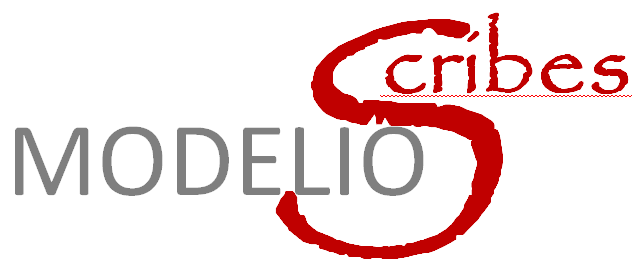

This open source project aims to build small useful "*plugins*" for the [Modelio](http://modelio.org) environement relying on the flexibility and concisness of jython scripting. The term "plugin" (which is not a modelio concept) is used here to refer to consistent set of jython scripts with possibily additional resources. While scripts are installed as "macros" in modelio some other are called by these macros. While macros are usually in a single file, we use here modular development as allowed by jython/python. 

The alternative to develop what we called "plugin" in jython, is to develop modelio modules in java. This requires much more effort though. 

Scribes
=======
This project currently hosts the specifications of various mini-projects. These projects are in the inception phase.

The first group corresponds to plugins that aims at simplifying the input of some models through the use of Simple Textual Notations. That is model elements are created either from reading a file or from an interactive window. In all cases a simple notation is used for fast typing.
* [GlossaryScribe](GlossaryScribe)
* [RequirementScribe](RequirementScribe)
* [UseCaseScribe](UseCaseScribe)
* [ClassScribe](ClassScribe)
* [SequenceScribe](SequenceScribe)
* [TextScribe](TextScribe)

* [AuditScribe](AuditScribe)
* [ReferenceScribe](ReferenceScribe)

* [OCLScribe](OCLScribe)
* [SQLScribe](SQLScribe)
* [ProjectScribe](ProjectScribe)
* [DoxyRevScribe](DoxyRevScribe)