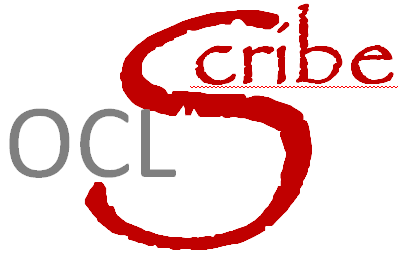

OCLScribe
=========
Generation of USEOCL models from a Modelio models.
 
Licence: GPL

Authors: 
* oussama housni -  main developer
* jmfavre - specification, documentation, refactoring and packaging

Compatibility: Modelio 3.x

Description
-----------
This macros generates a USEOCL model from a given model.
Currently the text is generated in a html window.

History
-------
* Version 1.1 - March 20,2014 - jmfavre
   * first refactoring
   * first packaging
* Version 1.0 - Jani-uary 12, 2014 - oussama
   * initial delivery

